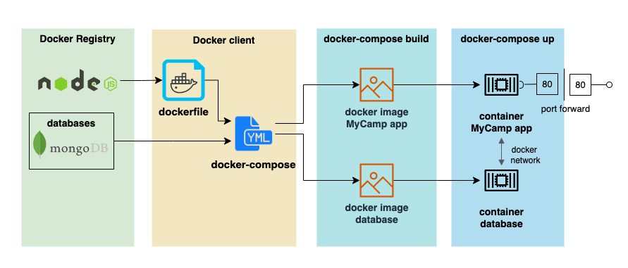

# MyCamp
*view, create, revise, and comment on campground blog hosted by AWS ECS Fargate*
## Features
- view campgrounds with photos, locations, description, and prices
   hp> index> camp
- register an user to creating and edit your own campground 
   reg> create camp include multiple img
- login to make a comment and rating on other campgrounds 
   login > select camp> leave comment
- Error handle with duplicated user, invalid form input
   reg with same name/ invalid reg input/
- images storage on cloud by Cloudinery API
  
- host on cloud by AWS ECS Fargate with AWS RDS(MySQL)
   AWS task run> go to the web
- host locally with NoSQL(MongoDB) or SQL(MySQL):
  
- for more detail, check [features.md](./docs/features.md):
