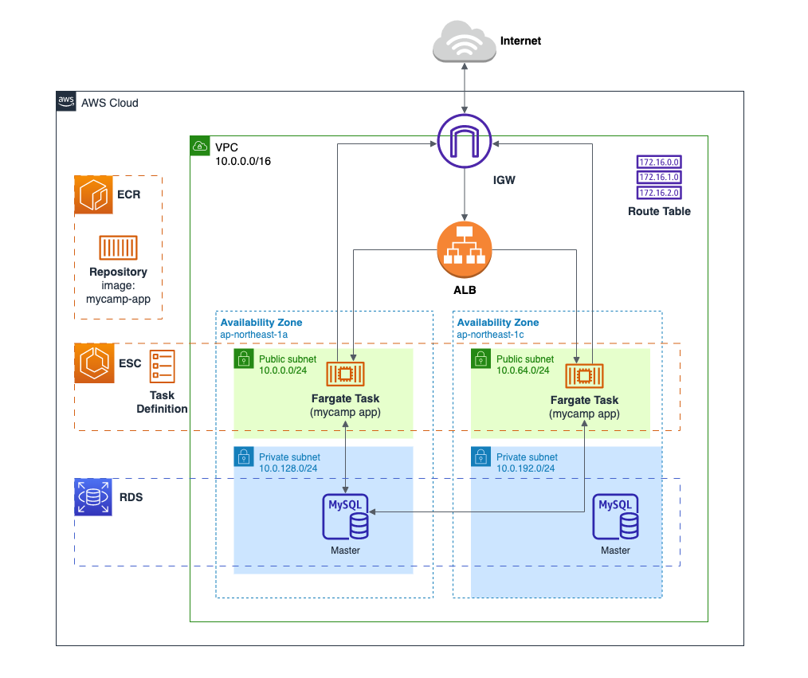
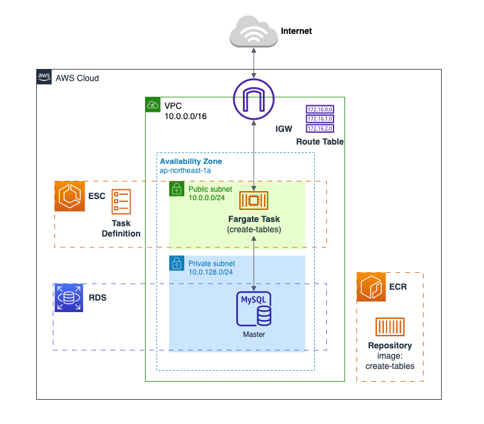
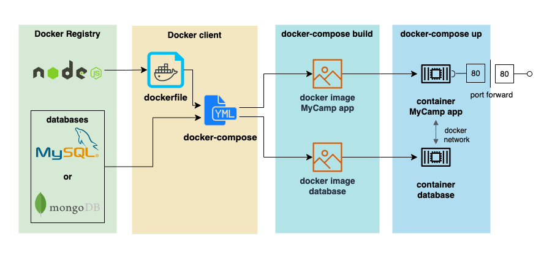

This demo "MyCamp" is derived from the project "YelpCamp"†. In addition to the basic full-stack features as YelpCamp, the following are the extra features:
1. Refactor the project from Javascript to Typescript
2. Migrate database from NoSQL(MongoDB) to SQL(MySQL)
3. Utilize docker compose to containerize the DB and the web server
4. Host the web server by AWS ECS Fargate with the database by AWS RDS(MySQL)

For further details, refer to the files in the docs folder:
- 
  the structure of website hosted on AWS with Elastic Container Service(ECS)
- 
  the structure of creating tables on private RDS MySQL DB instace
- 
  the structure of website hosted on localhost with app container and database container(MySQL or MongoDB)
- [create-tables-to-RDS.md](./create-tables-to-RDS.md): procedure to create SQL schema with AWS RDS MySQL instance not exposed to Internet
- [project-progress-log.md](./project-progress-log.md): the detailed progress log of this project

† "YelpCamp" is the project in the course "The Web Developer Bootcamp 2023" by Colt Steele at Udemy. YelpCamp Github link: https://github.com/Colt/YelpCamp.git
